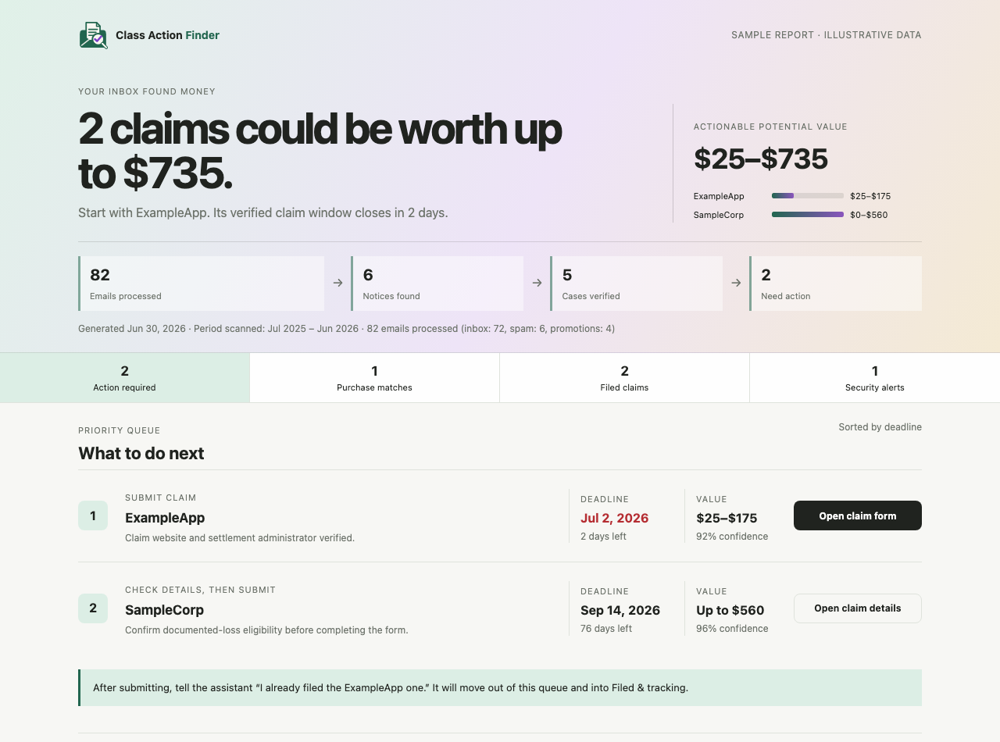
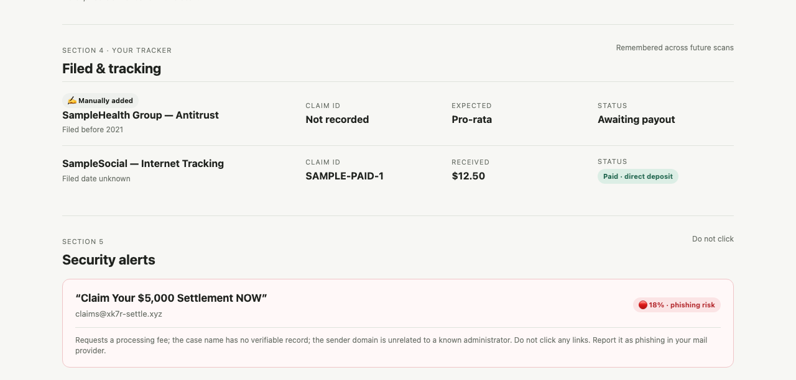

<p align="center">
  <picture>
    <source media="(prefers-color-scheme: dark)" srcset="skills/class-action-finder/assets/logo-lockup-dark.svg">
    
  </picture>
</p>

<p align="center">
  <strong>Find the settlement notices you received and the cases your purchases might reveal.</strong>
</p>

<p align="center">
  
  
  
</p>

---

> Settlement notices are easy to miss. Purchase-based cases may never contact you at all. Class Action Finder checks both paths, verifies what it finds, and turns the results into one private report.

Class Action Finder is a free, open-source AI skill for Claude, Codex, and ChatGPT. It works with connected email, keeps direct notices separate from receipt-based leads, flags suspicious claim links, and remembers what you filed or received.

<p align="center">
  
</p>

<p align="center">
  <sub>Illustrative UI with fictitious cases and amounts. No eligibility or payout is promised · <a href="docs/demo-report.html">open the HTML demo</a></sub>
</p>

## Two ways to find a claim

| | **Notice Scan** | **Purchase Match** |
|---|---|---|
| **Looks for** | Settlement notices, claim forms, filing confirmations, and payout emails | Receipts, order confirmations, renewals, and subscriptions |
| **Then does** | Extracts deadlines, payout terms, claim IDs, PINs, and verified claim links | Searches public sources for open settlements covering the merchant, product, and purchase period |
| **Result** | A verified notice with its deadline and next step | A possible match to review, never an automatic claim of eligibility |
| **Try it** | `Scan my email for class action settlements.` | `Scan my purchases for class actions.` |

Both paths feed the same local tracker and mobile-friendly HTML report, so filed claims stop appearing as unfinished tasks and payouts remain part of the record.

## Quick start

Install for your platform, connect a searchable mail integration, then just say what you want:

| Goal | Prompt |
|---|---|
| Find settlement notices | `Scan my email for class action settlements.` |
| Match receipts to possible cases | `Scan my purchases for class actions.` |
| Run both discovery paths | `Scan both my settlement notices and purchases.` |
| Track a claim or payout | `I filed my ExampleApp claim today.` |

Both scans cover the previous 12 months by default. Purchase Match treats every result as a lead until eligibility is confirmed. Add a merchant, product, or date range to narrow either scan.

On local runtimes, the HTML report is saved in the installed skill's `output/` folder as `class-action-report-YYYY-MM-DD.html`.

## Installation

Local Claude and Codex installations keep separate tracker files and do not overwrite one another.

<details>
<summary><strong>ChatGPT</strong></summary>

1. Download [`class-action-finder.skill`](https://raw.githubusercontent.com/yingying-chu/class-action-finder/main/dist/class-action-finder.skill).
2. In the ChatGPT sidebar, open **Plugins → Skills → Create → Upload from your computer**.
3. Upload the Skill and connect the **Gmail** or **Outlook Email** app.
4. Say: `Use $class-action-finder to scan my email for class action settlements.`

Personal Skills are generally available for ChatGPT Business, Enterprise, Healthcare, and Edu, subject to workspace settings. Hosted chats return the report and updated tracker as downloadable artifacts.

</details>

<details>
<summary><strong>Claude.ai</strong></summary>

1. Download [`class-action-finder.zip`](https://raw.githubusercontent.com/yingying-chu/class-action-finder/main/dist/class-action-finder.zip).
2. Ensure **Code execution and file creation** is enabled.
3. Open **Customize → Skills → + → Create skill → Upload a skill**.
4. Upload the ZIP and connect Gmail or another searchable mail integration.
5. Say: `Scan my email for class action settlements.`

Claude.ai returns the HTML report as a downloadable artifact. Keep the generated `class-action-tracker.json` if you want to reuse claim history in another chat.

</details>

<details>
<summary><strong>Claude Code</strong></summary>

```bash
git clone https://github.com/yingying-chu/class-action-finder.git
cd class-action-finder
./install.sh
```

Installs to `~/.claude/skills/class-action-finder/`. Restart Claude Code, connect a searchable Gmail or other mail connector, then invoke `/class-action-finder`.

</details>

<details>
<summary><strong>Codex</strong></summary>

```bash
git clone https://github.com/yingying-chu/class-action-finder.git
cd class-action-finder
./install.sh --codex
```

Installs to `${CODEX_HOME:-$HOME/.codex}/skills/class-action-finder/`. Restart Codex, connect a searchable Gmail or Outlook Email app/plugin, then invoke `$class-action-finder`.

</details>

Official setup references: [Skills in Claude](https://support.claude.com/en/articles/12512180-use-skills-in-claude) · [Google Workspace connectors](https://support.claude.com/en/articles/10166901-use-google-workspace-connectors) · [Skills in ChatGPT](https://help.openai.com/en/articles/20001066-skills-in-chatgpt)

## Report contents

The HTML report answers four questions:

- **What needs action now?** Open, verified notices sorted by deadline.
- **Which purchases might match?** Receipt-based leads that still need an eligibility check.
- **What have I already handled?** Watching, filed, paid, and expired cases.
- **What looks unsafe?** Suspicious notices and links kept out of the action queue.

Each finding shows its source, confidence, deadline, payout terms, and next step when available. Claim IDs and PINs stay in the private report.

<p align="center">
  
</p>

## Phishing safeguards

Email bodies, fetched pages, and search results are treated as untrusted data, not as instructions.

Each relevant notice is scored on independent public case verification, authenticated sender and administrator reputation, court and case identifiers, consistency with reported settlement amounts, claim-domain relevance, payment or credential requests, and common phishing patterns.

| Score | Level | Action |
|---|---|---|
| 85–100% | 🟢 High confidence | Verified links may be shown |
| 60–84% | 🟡 Likely legitimate | Proceed with the stated uncertainty |
| 40–59% | 🟠 Uncertain | Show a warning; do not open the claim URL |
| Below 40% | 🔴 Phishing risk | Move to Phishing Alerts; never render the URL |

Two conditions always force a 🔴 result, regardless of copied legitimate case details:

- a fee to file, process, release, or expedite a claim; or
- a request to submit a full SSN, bank-account number, or credit-card number through the notice.

Only absolute `https://` URLs that pass validation can become clickable. Reports contain no scripts, remote images, or inline event handlers and use a restrictive Content Security Policy.

## Storage and privacy

| Runtime | Tracker | Reports |
|---|---|---|
| Claude Code | `~/.claude/class-action-tracker.json` | `~/.claude/skills/class-action-finder/output/` |
| Codex | `${CODEX_HOME:-$HOME/.codex}/class-action-tracker.json` | `${CODEX_HOME:-$HOME/.codex}/skills/class-action-finder/output/` |
| Claude.ai / ChatGPT | Returned as a downloadable artifact | Returned as a downloadable artifact |

The report always goes to the `output/` directory that belongs to the skill copy being run, never the caller's current working directory or an unrelated repository. Everything generated under that directory is gitignored except `.gitkeep`, so a generated report can never be committed or pushed — by you or by anyone who forks this project.

On hosted runtimes, do not assume arbitrary files persist across chats; keep `class-action-tracker.json` and upload it when prior claim history is needed.

**Privacy boundaries**

- Email is read through the connected provider integration, and email content is never copied into this repository.
- Purchase matching sends only generic merchant/product search terms to the web. It never sends names, addresses, order numbers, account details, payment details, or raw receipt text.
- Purchase history is held only for the active scan and is not persisted unless you explicitly add a matched case to the watch list or tracker.
- Local reports and tracker records stay on your machine. Hosted artifacts follow that product's retention policy.
- Reports may contain private claim IDs or PINs and should be handled as sensitive personal records.

## Cost

A notice scan is typically a few cents to about a dollar of model usage, depending on which model runs it — search itself is free, and only full message retrieval costs real tokens. Purchase Match grows with mailbox volume.

The skill has **no fixed 100-message, 25-product, or 30-search ceiling**. It pages to completion and adaptively partitions dense date ranges rather than silently sampling a first page and calling it complete.

→ [Full cost model, per-model estimates, and why complete coverage is cheaper than it sounds](docs/cost.md)

## Scheduled scans

Any agent environment that can run a recurring prompt can schedule this skill:

```text
Scan my email for class action settlements from the last 30 days.
```

Run one manual scan first to confirm mail authorization, schedule weekly or monthly rather than daily, enable a completion notification, and keep the tracker current so handled claims stop appearing as filing tasks.

## Development

Contributor documentation lives in [`CLAUDE.md`](CLAUDE.md) — architecture, invariants, and packaging rules.

```bash
./scripts/package-skill.sh   # rebuild dist/ after editing the skill
./scripts/check.sh           # structural, install, privacy, and archive tests
```

| Change | File |
|---|---|
| Notice scan, purchase matching, record, or refresh behavior | [`SKILL.md`](skills/class-action-finder/SKILL.md) |
| Classification and field extraction | [`extraction-guide.md`](skills/class-action-finder/references/extraction-guide.md) |
| Confidence scoring and administrator domains | [`phishing-guide.md`](skills/class-action-finder/references/phishing-guide.md) |
| Report sections and presentation requirements | [`report-template.md`](skills/class-action-finder/references/report-template.md) |
| Logo mark, app icon, and wordmark | [`assets/`](skills/class-action-finder/assets/) |

## License

[MIT](LICENSE). Use, modify, and redistribute freely, including commercially, while retaining the copyright notice.
